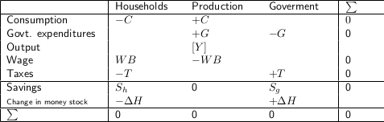
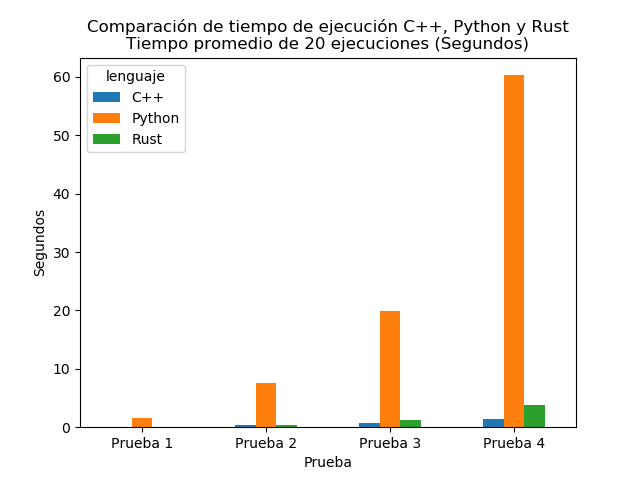

# SIMplest_MABM

## Introducción

Rust es un lenguaje de programación creado en 2010 por Mozilla. El lenguaje brinda seguridad de la memoria sin la necesidad de incorpora un recolector de basura. En septiembre de 2022, la versión 6.1 del kernel de Linux incorporó a Rust para escribir componentes del kernel.

Si bien Rust es utilizado principalmente para System Programming, en la academia comienza a utilizarse el lenguaje como alternativa a C y C++ ([ver](https://www.nature.com/articles/d41586-020-03382-2)).

En esta implementación se realiza un comparativo entre tiempos de ejecución de un Modelo Macroeconómico Basado en Agentes propuesto por [Alessandro Caiani](https://sites.google.com/view/alessandro-caiani/teaching#h.p_NCwo3LmKcTZs) ("the SIMplest model"). Dicho modelo es desarrollado en Python y Rust. Se evaluan los tiempos de ejecución de ambas implementaciones con distintas cargas de trabajo.

## Modelo

### Supuestos

El modelo propuesto por [Alessandro Caiani](https://sites.google.com/view/alessandro-caiani/teaching#h.p_NCwo3LmKcTZs) supone lo siguiente:

* No hay dinero privado:
	- No hay bancos ni créditos ni pagos de interés.
* Economía cerrada:
	- No hay importaciones ni exportaciones.
	- No hay flujos de capital.
* Economía con sólo trabajo como factor de la producción.
	- No hay capital. 
	- No hay costos intermedios.
	
### Sectores

* Hogares:
	- Compran bienes de consumo y pagan impuestos.
	- Obtienen salario.
	- Acumulan activos.
	
* Productores:
	- Venden bienes y servicios a los hogares y gobierno.
	- Pagan salarios e impuestos.
	
* Gobierno:
	- Compran bienes y servicios a los productores.
	- Recaudan impuestos.

El activo del modelo es el dinero (*high powered money*).

Las interrelaciones entre sectores queda expresada en las matrices de flujos y acervos.

### Parámetros exógenos

* Número de hogares.
* Número de firmas.
* Productividad laboral.
* Propensión a consumir sobre el ingreso.
* Propensión a consumir sobre la riqueza.
* Tasa de impuestos.
* Gasto real del gobierno.
* Salarios.
* Precios.

## Definición de las ejecuciones de prueba

Comparamos las ejecuciones de modelo en Python y Rust para las siguientes cuatro pruebas:

## Resultados 

Para las 4 pruebas realizadas, la implementación en Rust es entre 14 y 16 veces más rápida que la implementación en Python.

Las siguientes figuras muestran la tasa de desempleo estimada para cada implementación.

